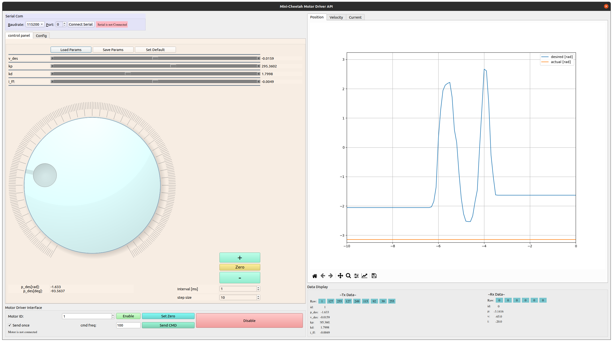

# minicheetah_actuator_APP
App for minicheetah BLDC motor driver




`app` directory contains the scripts of Mini-Cheetah motor controller GUI app which is developed using PyQt5.
`uart_can_brige` directory contains the firmaware of UART-CAN bridge for STM32F103C8T6 (Blue Pill) and scratch of the circuit diagram for UART-CAN bridge.

### Install dependencies
- `pip3 install pyqt5`
- `pip3 install pyserial`
- `pip3 install matplotlib`

### Run App:
```
python3 app/main.py

```

### Parameters can be controlled:
    - `p_des`: desired position
    - `v_des`: desired velocity
    - `kp`: stiffness
    - `kd`: damping
    - `i_ff`: Feed forward current

